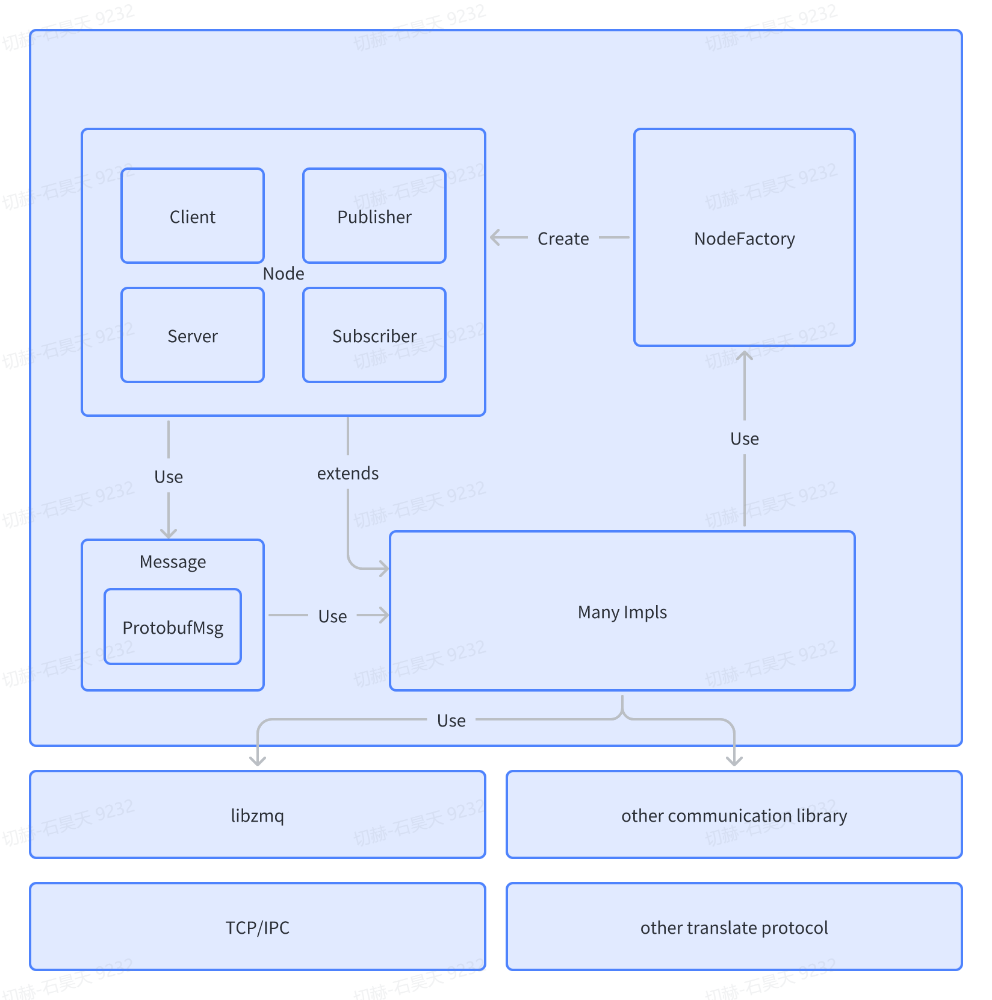

# 概述

## EZcom是什么

EZcom是一个轻量化、API易用的C++通信库

EZcom使用protobuf进行序列化，底层封装了ZMQ进行通信，并原生支持ZMQ的IPC和TCP通信模式。

因此EZcom需要依赖的三方库有：
- [protobuf (>=3.6.0)](https://github.com/protocolbuffers/protobuf)
- [libzmq (>=4.3.2)](https://github.com/zeromq/libzmq)

## EZcom支持什么

- 支持跨域、跨设备tcp网络通信
- client-server模式下支持connect回调获取当前连接状态
- 支持的通信模式
  - 同步-异步请求回复/超时机制
  - 发布-订阅消息模式/topic机制
- 支持基本数据类型的自动序列化
  - int32
  - int64
  - uint32
  - uint64
  - float
  - double
  - bool
  - string
- 支持用户自定义数据结构的强制序列化，利用reinterpret_cast强制转换。需要两端字节对齐

### 请求-回复模式 与 发布-订阅模式

|                | 请求-回复模式                                    | 发布-订阅模式                                    |
| -------------- | ------------------------------------------------ | ------------------------------------------------ |
| **定义**       | 请求者向回复者发送请求消息，并等待回复           | 发布者向订阅者广播消息，不关心订阅者是否接收到 |
| **关系**       | 一对一                                           | 一对多                                           |
| **地址**       | 请求者需要明确知道回复者的地址                   | 发布者无需知道订阅者的地址                      |
| **处理**       | 回复者需要处理请求并返回结果                      | 订阅者可以选择订阅自己感兴趣的主题，并接收消息 |
| **时序**       | 请求和回复之间具有一定的时序关系                 | 消息的发送和接收是异步的                        |
| **阻塞**       | 请求者需要等待回复者的回复，可能会阻塞等待       | 不需要等待对方的响应                             |
| **解耦合**     | 请求者和回复者之间紧密耦合，难以解耦合           | 发布者和订阅者之间没有直接的联系，易于解耦合    |
| **使用场景**   | 客户端与服务器之间的请求和响应通信                | 日志记录、消息通知、事件驱动等                  |
| **优缺点**     | 可以确保请求和回复之间的时序关系，但耦合度高     | 可以实现解耦合，但无法确保消息被接收             |

## EZcom的架构设计图

