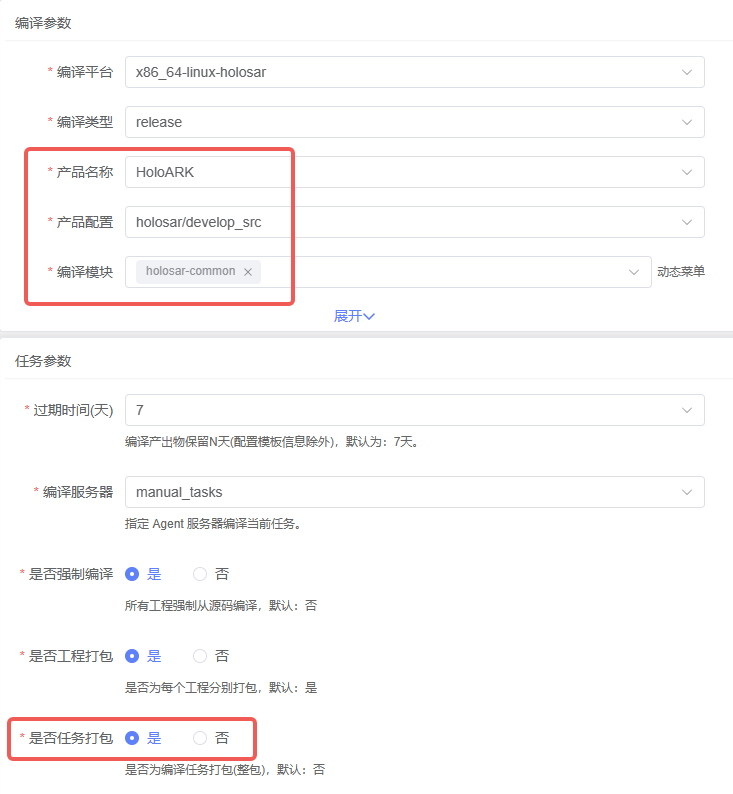
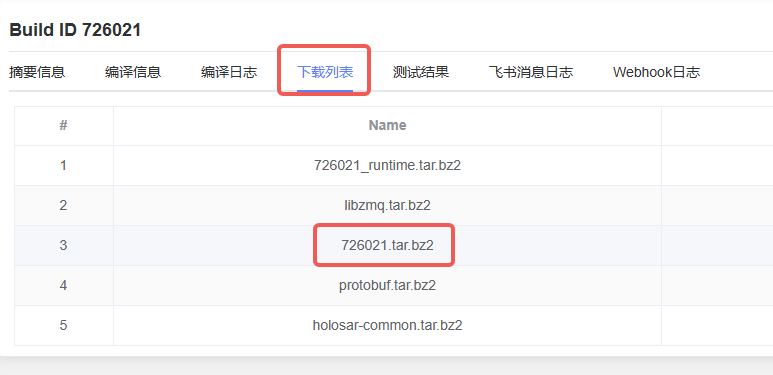

# 快速开始

## 安装

### 从HoloBuilder获取二进制包

1. 登录HoloCI，选择创建任务。链接：https://ci.holomatic.com/index/personal

2. 编译参数按下图选择，然后创建任务即可


3. 等待任务编译完成，下载编译好的二进制包



### 从源码安装

**注意**：
1. 要从源码安装EZcom需要拥有holosar-common仓库的读取权限
2. 本地需要安装holobuilder的编译环境

```bash
# 1. 创建holobuilder的工作空间
mkdir ezcom && cd ezcom
holobuilder create

# 2. 配置holobuilder工作空间的参数
holobuilder configure --build_platform x86_64-linux-holosar
holobuilder configure --build_product HoloARK/holosar/develop_src
holobuilder configure --build_type release

# 3. 下载编译链工具
holobuilder download --crosstool

# 4. 开始编译EZcom及其依赖的库
holobuilder build holosar-common -r

# 5. 在output目录下即可找到EZcom的二进制文件
```


## 集成到你的项目

### 集成到你的Holobuilder项目

1. 在你的project中添加holosar-commmon的依赖，例如
```yaml
  holosar-ara-sm:
    url: ${git_url}/holosar/holosar-ara-sm.git
    branch: master
    dependencies: [boost, libzmq, jsoncpp, gtest, holo_cmake_scripts, holosar-common, holosar-ara-core, holosar-ara-log, holosar-ara-per, holosar-ara-com, holosar-ara-exec]
    package:
      manifest: ${BUILD_ROOT}/install_manifest.txt
      files: []
      directories: []
```

2. 在你的project的CMakeLists.txt中添加EZcom，例如
```cmake
find_package(holosar-common REQUIRED)

target_link_libraries(${TARGET_NAME}
    holosar::ezcom
)
```

3. 即可在您的项目代码中使用EZcom！使用EZcom的头文件时只需要包含`#include "ezcom/node_factory.h"`即可

### 集成到你的普通项目


# 用法

## 基本用法

### 请求-回复模式

- 创建Server

1. 导入头文件
```cpp
#include "ezcom/node_factory.h"
```

2. 使用工厂类创建Server节点。参数为通信协议类型（enum），目前支持`kZmqTcp`和`kZmqIpc`两种协议
```cpp
std::unique_ptr<holosar::ezcom::Server> server_up = NodeFactory::CreateServer(TransportType::kZmqTcp);
```

3. 绑定Server到地址，并注册消息处理回调函数。如果在创建Server是选择的是`kZmqTcp`协议，则地址格式为`ip:port`，如果选择的是`kZmqIpc`协议，则地址格式为`任意字符串`。Server端收到消息后，会调用回调函数处理消息，回调函数的参数为`const std::shared_ptr<Message>&`类型，返回值为`std::shared_ptr<Message>`类型。回调函数的返回值将作为回复消息发送给请求方
```cpp
server_up->Bind("127.0.0.1:8899",
                  [](const std::shared_ptr<Message> &msg)
                      -> const std::shared_ptr<Message> {
                    auto reply_msg = std::make_shared<Message>();
                    reply_msg->AddInt32(msg->GetInt32(0) + 1);
                    return reply_msg;
                  });
```

4. 当Server的unique_ptr被析构时，Server会自动释放资源，包括关闭所有连接，释放所有消息队列等


- 创建Client

1. 导入头文件
```cpp
#include "ezcom/node_factory.h"
```

2. 使用工厂类创建Client节点。参数为通信协议类型（enum），目前支持`kZmqTcp`和`kZmqIpc`两种协议
```cpp
std::unique_ptr<holosar::ezcom::Client> client_up = NodeFactory::CreateClient(TransportType::kZmqTcp);
```

3. 连接到Server地址，并注册连接事件回调函数。如果在创建Client是选择的是`kZmqTcp`协议，则地址格式为`ip:port`，如果选择的是`kZmqIpc`协议，则地址格式为`任意字符串`。Client端连接到Server后，会调用回调函数通知连接状态，回调函数的参数为`const ConnectionEvent&`（enum）类型
```cpp
client_up->Connect("127.0.0.1:8899",
                    [](const ConnectionEvent &event) {
                      if (event == ConnectionEvent::kConnected) {
                        std::cout << "Connect success" << std::endl;
                      }
                    });
```

4. 使用Client同步接口发送消息给Server，并同步等待回复。发送的消息为`std::shared_ptr<Message>`类型，回复的消息也为`std::shared_ptr<Message>`类型。同步等待回复的超时时间单位为毫秒，默认值-1，一直等待。如果设置了超时时间且发生超时，则返回`ResultType::kTimeout`，如果成功则返回`ResultType::kSuccess`，如果失败则返回`ResultType::kFailed`，失败的原因可能是连接断开或者其他错误。如果成功，可以从`Result`结构体中获取回复的消息
```cpp
auto msg = std::make_shared<Message>();
msg->AddInt32(99);
auto result = client_up->SyncRequest(msg, 1000);

if (result.res_type == ResultType::kSuccess) {
  std::cout << "sync result reply: " << result.rep_message->GetInt32(0)
            << std::endl;
}
```

5. 使用Client异步接口发送消息给Server，并异步等待回复。发送的消息为`std::shared_ptr<Message>`类型，回复的消息也为`std::shared_ptr<Message>`类型。异步等待回复的超时时间单位为毫秒，默认值-1，一直等待。如果设置了超时时间且发生超时，则返回`ResultType::kTimeout`，如果成功则返回`ResultType::kSuccess`，如果失败则返回`ResultType::kFailed`，失败的原因可能是连接断开或者其他错误。如果成功，可以从`Result`结构体中获取回复的消息。异步等待回复的结果会通过回调函数返回，回调函数的参数为`const Result`类型
```cpp
auto msg = std::make_shared<Message>();
msg->AddInt32(101);
client_up->AsyncRequest(
    msg,
    [](const Result result) {
      if (result.res_type == ResultType::kSuccess) {
        std::cout << "async result reply: "
                  << result.rep_message->GetInt32(0) << std::endl;
      }
    },
    1000);
```

6. 当Client的unique_ptr被析构时，Client会自动释放资源，包括关闭所有连接，释放所有消息队列等

### 发布-订阅模式

- 创建Publisher

1. 导入头文件
```cpp
#include "ezcom/node_factory.h"
```

2. 使用工厂类创建Publisher节点。参数为通信协议类型（enum），目前支持`kZmqTcp`和`kZmqIpc`两种协议
```cpp
std::unique_ptr<holosar::ezcom::Publisher> pub = NodeFactory::CreatePublisher(TransportType::kZmqTcp);
```

3. 绑定Publisher到地址。如果在创建Publisher是选择的是`kZmqTcp`协议，则地址格式为`ip:port`，如果选择的是`kZmqIpc`协议，则地址格式为`任意字符串`。
```cpp
pub->Bind("127.0.0.1:7788");
```

4. 创建并发布消息。发布的消息为`std::shared_ptr<Message>`类型，发布的主题为`std::string`类型
```cpp
auto msg = std::make_shared<Message>();
msg->AddInt32(i);
pub->Publish(msg, "test_topic");
```

5. 当Publisher的unique_ptr被析构时，Publisher会自动释放资源，包括关闭所有连接等

- 创建Subscriber

1. 导入头文件
```cpp
#include "ezcom/node_factory.h"
```

2. 使用工厂类创建Subscriber节点。参数为通信协议类型（enum），目前支持`kZmqTcp`和`kZmqIpc`两种协议
```cpp
std::unique_ptr<holosar::ezcom::Subscriber> sub = NodeFactory::CreateSubscriber(TransportType::kZmqTcp);
```

3. 订阅到地址，并注册消息处理回调函数。如果在创建Subscriber是选择的是`kZmqTcp`协议，则地址格式为`ip:port`，如果选择的是`kZmqIpc`协议，则地址格式为`任意字符串`。Subscriber端收到消息后，会调用回调函数处理消息，回调函数的参数为`const std::shared_ptr<Message>&`类型。**注意**：请不要在回调函数中做耗时操作，否则会影响消息接收。
```cpp
sub->Subscribe(
      "127.0.0.1:7788",
      [](const std::shared_ptr<Message> &msg) {
        std::cout << "recv msg: " << msg->GetInt32(0) << std::endl;
      },
      "test_topic");
```

4. 当Subscriber的unique_ptr被析构时，Subscriber会自动释放资源，包括关闭所有连接等

## example整体代码参考

### 请求-回复模式

```cpp
#include <chrono>
#include <future>
#include <iostream>
#include <thread>

#include "ezcom/node_factory.h"

using namespace holosar::ezcom;

void server_func() {
  // create server node with zmq_tcp protocol, or you can choose
  // zmq_ipc protocol by use [TransportType::kZmqIpc]
  auto server_up = NodeFactory::CreateServer(TransportType::kZmqTcp);
  // bind server to address and setting message handle callback function
  // this callback function will be called when server receive message
  // and this callback function must return a message
  server_up->Bind("127.0.0.1:8899",
                  [](const std::shared_ptr<Message> &msg)
                      -> const std::shared_ptr<Message> {
                    auto reply_msg = std::make_shared<Message>();
                    reply_msg->AddInt32(msg->GetInt32(0) + 1);
                    return reply_msg;
                  });

  std::this_thread::sleep_for(std::chrono::seconds(10));
}

void sync_client_func() {
  // create client node with zmq_tcp protocol
  auto client_up = NodeFactory::CreateClient(TransportType::kZmqTcp);
  std::promise<bool> promise;
  auto future = promise.get_future();

  // connect to server address and setting connection event callback function
  // this callback function will be called when client connect to server
  client_up->Connect("127.0.0.1:8899",
                     [&promise](const ConnectionEvent &event) {
                       if (event == ConnectionEvent::kConnected) {
                         promise.set_value(true);
                       }
                     });

  if (future.get()) {
    std::cout << "sync client connect success" << std::endl;

    // create message
    auto msg = std::make_shared<Message>();
    msg->AddInt32(99);
    // sync request message to server and wait for reply
    // you can set timeout(ms) for sync request, default value is -1
    // means wait forever
    auto result = client_up->SyncRequest(msg, 1000);
    // return value is a struct [Result]
    // it contains a enum [ResultType] and a shared_ptr [rep_message]
    // you can check [ResultType] to see if request success and why request
    // failed if success, you can get reply message from [rep_message] if
    // failed, [rep_message] will be nullptr
    std::cout << "sync result enum: " << (int)result.res_type << std::endl;
    if (result.res_type == ResultType::kSuccess) {
      std::cout << "sync result reply: " << result.rep_message->GetInt32(0)
                << std::endl;
    }
  }

  std::this_thread::sleep_for(std::chrono::seconds(10));
}

void async_client_func() {
  auto client_up = NodeFactory::CreateClient(TransportType::kZmqTcp);
  std::promise<bool> promise;
  auto future = promise.get_future();
  client_up->Connect("127.0.0.1:8899",
                     [&promise](const ConnectionEvent &event) {
                       if (event == ConnectionEvent::kConnected) {
                         promise.set_value(true);
                       }
                     });

  if (future.get()) {
    std::cout << "async client connect success" << std::endl;

    auto msg = std::make_shared<Message>();
    msg->AddInt32(101);
    // async request message to server and setting callback function and
    // timeout(ms). timeout default value is -1 means wait forever
    // this callback function will be called when request success or
    // failed, result will be passed to callback function.
    // if success, [result.res_type] will be [ResultType::kSuccess] and
    // [result.rep_message] will be reply message.
    // if failed, [result.res_type] will be why request failed and
    // [result.rep_message] will be nullptr.
    client_up->AsyncRequest(
        msg,
        [](const Result result) {
          std::cout << "async result enum: " << (int)result.res_type
                    << std::endl;
          if (result.res_type == ResultType::kSuccess) {
            std::cout << "async result reply: "
                      << result.rep_message->GetInt32(0) << std::endl;
          }
        },
        1000);
  }

  std::this_thread::sleep_for(std::chrono::seconds(10));
}

int main(int argc, char const *argv[]) {
  std::thread t1(sync_client_func);
  std::thread t2(async_client_func);
  std::thread t3(server_func);
  t1.join();
  t2.join();
  t3.join();
  return 0;
}
```


### 发布-订阅模式
```cpp
#include <chrono>
#include <iostream>
#include <thread>

#include "ezcom/node_factory.h"

using namespace holosar::ezcom;

void pub_func() {
  // create publisher node with zmq_tcp protocol, or you can choose
  // zmq_ipc protocol by use [TransportType::kZmqIpc]
  auto pub = NodeFactory::CreatePublisher(TransportType::kZmqTcp);
  // bind publisher to address
  pub->Bind("127.0.0.1:7788");
  for (int i = 0; i < 10; i++) {
    // create message
    auto msg = std::make_shared<Message>();
    msg->AddInt32(i);
    // publish message to specific topic
    pub->Publish(msg, "test_topic");
    std::this_thread::sleep_for(std::chrono::milliseconds(500));
  }
}

void sub_func() {
  // subscriber start later than publisher, will miss some message
  std::this_thread::sleep_for(std::chrono::seconds(1));
  // create subscriber node with zmq_tcp protocol
  auto sub = NodeFactory::CreateSubscriber(TransportType::kZmqTcp);
  // subscribe to address and setting callback function and topic
  sub->Subscribe(
      "127.0.0.1:7788",
      [](const std::shared_ptr<Message> &msg) {
        std::cout << "recv msg: " << msg->GetInt32(0) << std::endl;
      },
      "test_topic");

  std::this_thread::sleep_for(std::chrono::seconds(10));
}

int main(int argc, char const *argv[]) {
  std::thread t1(pub_func);
  std::thread t2(sub_func);
  t1.join();
  t2.join();
  return 0;
}
```


